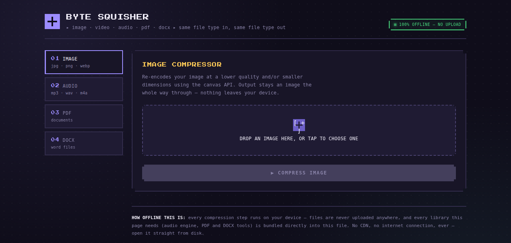

# Byte Squisher

A single-file, fully offline compressor for images, audio, PDFs, and DOCX files. Every file goes in and comes back out as the **same file type** — a JPEG stays a JPEG, a PDF stays a PDF.

Open `index.html` in any modern browser. That's the whole install — or [install it as an app](#installing-it-as-an-app) for a real icon and offline launch.

## What it looks like

A tab down the left for each file type (Image, Audio, PDF, DOCX), a drag-and-drop zone, and a compress button. Everything is styled in a dark, pixel-font, retro-terminal look, with a green "100% OFFLINE — NO UPLOAD" badge always visible in the header.

## Why it's fully offline

Everything the page needs is baked directly into the single HTML file — there are no `<script src>` tags, no `<link>` tags, and no `fetch`/`XHR` calls to any external server, ever:

- **Compression libraries** are inlined: [JSZip](https://stuk.github.io/jszip/), [pdf-lib](https://pdf-lib.js.org/), [jsPDF](https://github.com/parallax/jsPDF), and [pdf.js](https://mozilla.github.io/pdf.js/) (including its worker script, embedded as base64 and turned into a Blob URL at runtime).
- **Audio encoding** uses a bundled MP3 encoder ([lamejs](https://github.com/zhuker/lamejs)) plus the browser's native Web Audio API — no server-side transcoding.
- **The display font** (Press Start 2P) is embedded as a base64 `@font-face`, not loaded from Google Fonts.
- **Files never leave your device.** Nothing is uploaded anywhere; all compression happens client-side in your browser.

You can disconnect from the internet entirely before opening the file and everything still works.

## Installing it as an app

Byte Squisher is also a PWA (Progressive Web App), so it can be installed like a native app with its own icon and window, and it keeps working offline after the first load:

1. Serve the folder (not `file://`) over `http://` or `https://` — for example `npx serve .` locally, or host it on any static host / GitHub Pages. Service workers require a real origin, so opening `index.html` directly from disk still works as a webpage but skips the install prompt.
2. Open `index.html` in Chrome, Edge, or Safari.
3. Use the browser's "Install app" / "Add to Home Screen" option (in Chrome/Edge, a small install icon appears in the address bar).
4. The app installs with the Byte Squisher icon, opens in its own window, and is cached for offline use via `sw.js`.

This adds a few small extra files alongside `index.html`:

- `manifest.json` — app name, theme color, and icon list
- `sw.js` — the service worker that caches the app for offline use after the first visit
- `icon-192.png`, `icon-512.png`, `icon-maskable-512.png` — the app icon at the sizes Android/desktop expect
- `apple-touch-icon.png`, `favicon-32.png`, `favicon-16.png` — icon for iOS home screen and browser tabs

`index.html` itself is still the whole app — the extra files are only needed for the "installable app with an icon" experience. If you just want to open the HTML file locally and use it, nothing changes.

## Tools included

| Tab | What it does | Output |
|---|---|---|
| **Image** | Re-encodes at a lower quality and/or smaller max width via the Canvas API | JPEG, WebP, or PNG |
| **Audio** | Decodes and re-encodes as a real MP3 at your chosen bitrate | MP3 |
| **PDF** | *Standard* mode re-saves with an optimized internal structure (text stays selectable). *Aggressive* mode rasterizes each page as a compressed image (much smaller, but text is no longer selectable) | PDF |
| **DOCX** | Re-encodes embedded images and repacks the internal zip at maximum compression; text and formatting are untouched | DOCX |

## How to use it

1. Pick a tab for your file type.
2. Drag a file onto the drop zone, or tap it to browse.
3. Adjust the quality/bitrate/mode settings shown.
4. Click **Compress**.
5. Download the result — it shows original size, compressed size, and % saved.

## Notes & limits

- Already-compressed files (photos that are already low quality, heavily-compressed MP3s, etc.) won't shrink much further — that's expected, not a bug.
- PDF "Aggressive" mode and MP3 encoding are CPU-bound and run entirely in your browser tab, so very large files take a little time.
- Requires a browser with Canvas, Web Audio, and `CompressionStream`-era JS support — recent Chrome, Edge, Firefox, or Safari.
- The file is large (~3 MB) because every library is embedded rather than loaded from a CDN — that's the tradeoff for true offline use.

## Files

- `index.html` — the entire app. Single file, no dependencies, no build step.
- `manifest.json`, `sw.js` — PWA manifest and service worker (only needed for installing as an app; see above).
- `icon-*.png`, `favicon-*.png`, `apple-touch-icon.png` — app icons for install/home-screen/tab use.
